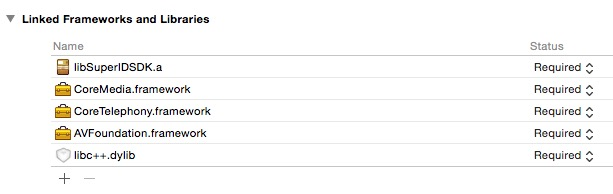
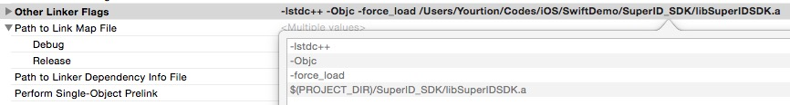
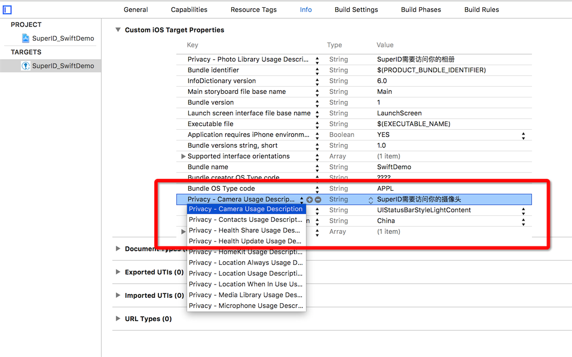

## 使用步骤

1. 下载一登SDK [iOS SDK下载](https://github.com/SuperID/superid-ios-sdk/archive/master.zip)
2. 复制文件夹 `SuperID-SDK-iOS` 至 Sample 工程文档目录下。
3. 开始调试运行

- **已经更新至 Swift 3.0 正式版本，使用 Swift 2.x 用户请切换到 [`Swift2`](https://github.com/SuperID/superid-swift-sample/tree/Swift2) 分支**
- **使用 Xcode6 用户请切换到 [`Xcode6`](https://github.com/SuperID/superid-swift-sample/tree/Xcode6) 分支**

## 常见问题

### 使用工程编译问题

在工程的```Bridging_Header```头文件中添加

```objective-c
#import "SuperID.h"
#import "SuperIDDelegate.h"
#import "SIDFaceFeatureViewController.h"
```


确保已经引入下列框架，否则可能会出错：

- `AVFoundation.framework`
- `CoreMedia.framework`
- `CoreTelephony.framework`



同时确保在 `Build Setting` 的 `Other Linker Flags` 中添加以下代码：

```
-lstdc++
-Objc
-force_load
$(PROJECT_DIR)/SuperID_SDK/libSuperIDSDK.a
```




### iOS10 权限问题

如果遇到下面的错误：

> This app has crashed because it attempted to access privacy-sensitive data without a usage description. The app's Info.plist must contain an NSCameraUsageDescription key with a string value explaining to the user how the app uses this data.

需要在 `Info.plist` 添加摄像头与相册权限描述（用于选择用户头像）：

```xml
<key>NSPhotoLibraryUsageDescription </key>
<string>SuperID需要访问你的相册</string>
<key>NSCameraUsageDescription</key>
<string>SuperID需要访问你的摄像头</string>
```



